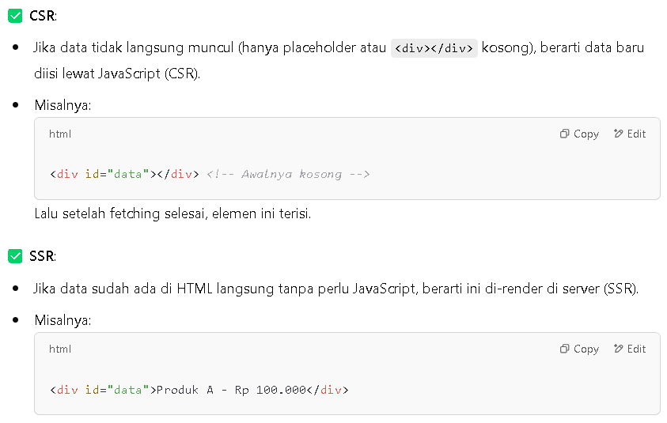

Hello, Lecturer!

+ Cara Membedakan CSR dan SSR di Inspect Browser?

        1. Cek di `Tab Network`
        
                - CSR (Client Side Rendering)

                                1. Inspect Element

                                2. Pilih Tab `Network`

                                3. Pilih Filter `Fetch/XHR`

                                4. Apabila Muncul Request API, Maka Itu `CSR`

                                atau

                                1. Inspect Element

                                2. Pilih Tab `Network`

                                3. Pilih Filter `Doc`

                                4. Pilih Tab `Response`

                                5. Apabila Berisikan Code Javascript, Maka Itu `CSR`

                - SSR (Server Side Rendering)

                                1. Inspect Element

                                2. Pilih Tab `Network`

                                3. Pilih Filter `Doc`

                                4. Pilih Tab `Response`

                                5. Apabila Berisikan HTML yang Berisikan Data, Maka Itu `SSR`

        2. Cek di `Tab Elements`

                        